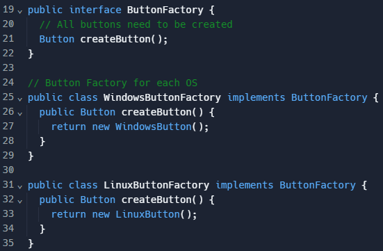
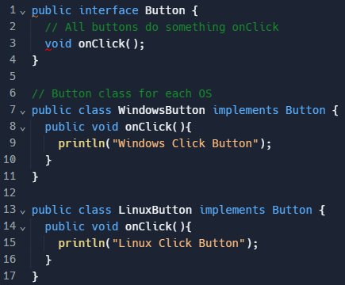
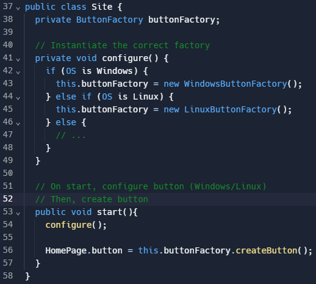
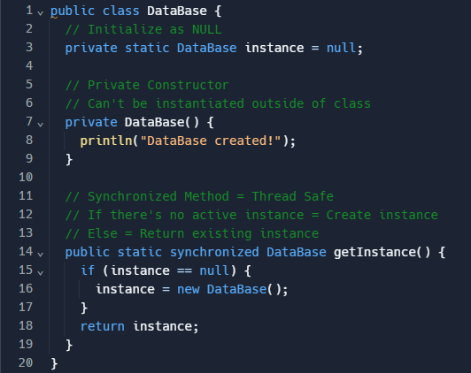

# Desafio Murano - Questão 3 - Padrões de Projeto

Este repositório responde as questões solicitadas sobre Padrões de Projeto, Melhorias na Arquitetura e Escolha de Criação de Padrão Adequado.

## Padrões de Projeto

Padrões de Projeto são padrões abstratos para guiar a criação de uma arquitetura de classes e objetos de forma a resolver problemas específicos de uma forma mais flexível e eficiente.

1. **Padrões Criacionais**

    Estão relacionados com a filosofia do código para a criação de objetos e classes com o objetivo de melhorar a flexibilidade e reutilização do código. Um exemplo é o padrão Singleton que propõe que uma classe possua apenas uma instância e que essa instância se torne ponto global de acesso ao objeto. Em caso de solicitação de uma nova instância, a mesma instância, já criada, é retornada. Esse tipo de padrão é útil para objetos únicos que devem ser compartilhados entre diversas partes do programa pois garante que todas as partes terão acesso ao mesmo conteúdo.

2. **Padrões Estruturais**

    Estão relacionados com métodos de integrar classes e objetos para que elas formem estruturas maiores com o objetivo de se manterem eficientes. Um exemplo é o padrão Adapter que propõe o uso de adaptadores, que seriam estruturas responsáveis pela conversão entre interfaces incompatíveis de um sistema. Esse padrão se mostra útil, por exemplo, em casos que partes do código utilizam formatos de dados diferentes (Ex: XML e JSON), ao criar uma adaptador entre os dois formatos as duas aplicações do sistema irão se comunicar através de um intermediário responsável por abstrair essa interface.

3. **Padrões Comportamentais**

    Estão relacionados com a interação entre objetos e designação de como eles se comportam entre si. Um exemplo é o padrão Iterator que propõe que o acesso a uma estrutura de dados seja abstraído ao código cliente. Em casos que existam diversas formas para percorrer uma estrutura de dados, pode se criar um classe iterador que oferece métodos simples de percorrer a estrutura (Abstração) ou, em casos de diversas estruturas de dados diferentes pode-se usar um mesmo iterador para oferecer métodos para todas as estruturas (Evitar duplicação de código).

## Melhorias na Arquitetura

A proposta do Padrão Factory é a delegação da criação de objetos para subclasses. São criadas Classes Fábrica Abstrata que  decidem qual SubClasse deve ser instanciada dependendo dos parâmetros utilizados. Para a melhoria da implementação seguindo essa filosofia de design, foi criada uma Classe `ButtonFactory` que decide qual SubClasse `WindowsButtonFactory` ou `LinuxButtonFactory` deve ser instanciada dependendo do Sistema Operacional do Cliente. Essas SubClasses Fábrica possuem os métodos necessários para a criação do tipo específico de Objeto Botão necessário para o Cliente.

Além disso, foi criada uma Classe `Button` para ser uma Classe Abstrata das SubClasses `WindowsButton` e `LinuxButton` que são instanciadas pelas fábricas `WindowsButtonFactory` e `LinuxButtonFactory`, respectivamente. Dessa forma, seria possível implementar diferentes tipos de botão a depender dos parâmetros do Cliente.

Por fim, a implementação da Classe `Site` fica mais simples pois só será necessário uma instância da Fábrica Abstrata de botões (`ButtonFactory`) que será configurada à depender dos parâmetros do Cliente a partir da função `configure()`. Ao fim da configuração, o botão pode ser instanciado da forma adequada para o Cliente.

## Criação de Padrão Adequado

Como exemplificado na Seção [Padrões de Projeto](#padrões-de-projeto), o padrão Singleton garante que apenas uma instância da classe seja criada e que essa única instância seja acessível globalmente. Quando outras partes do sistema solicitam uma instância, elas recebem a mesma instância já criada anteriormente. Por isso, esse é o padrão ideal para atender as demandas da Classe Banco de Dados no cenário descrito.

Para evitar que seja criada uma nova instância por engano, o Construtor da Classe é um método privado que só é acessado dentro da Classe DataBase através do método público `getInstance()` que retorna uma nova instância somente quando não existe uma instância naquele momento (`instance = null`). Para evitar problemas de concorrência, o método `getInstance()` utiliza o modificador `synchronized` que serializa o acesso ao método para que somente uma Thread possa receber a instância ao mesmo tempo. Dessa forma, é evitado o caso de condição de corrida em que duas ou mais Threads enxergam que não existe uma instância e criam uma nova instância separadamente.

Essa Classe ainda poderia ser otimizada pois a Condição de Corrida acontece somente quando não existe um objeto Banco de Dados, no caso de já existir uma instância, o acesso simultâmeno não gera problemas relacionados à concorrência.